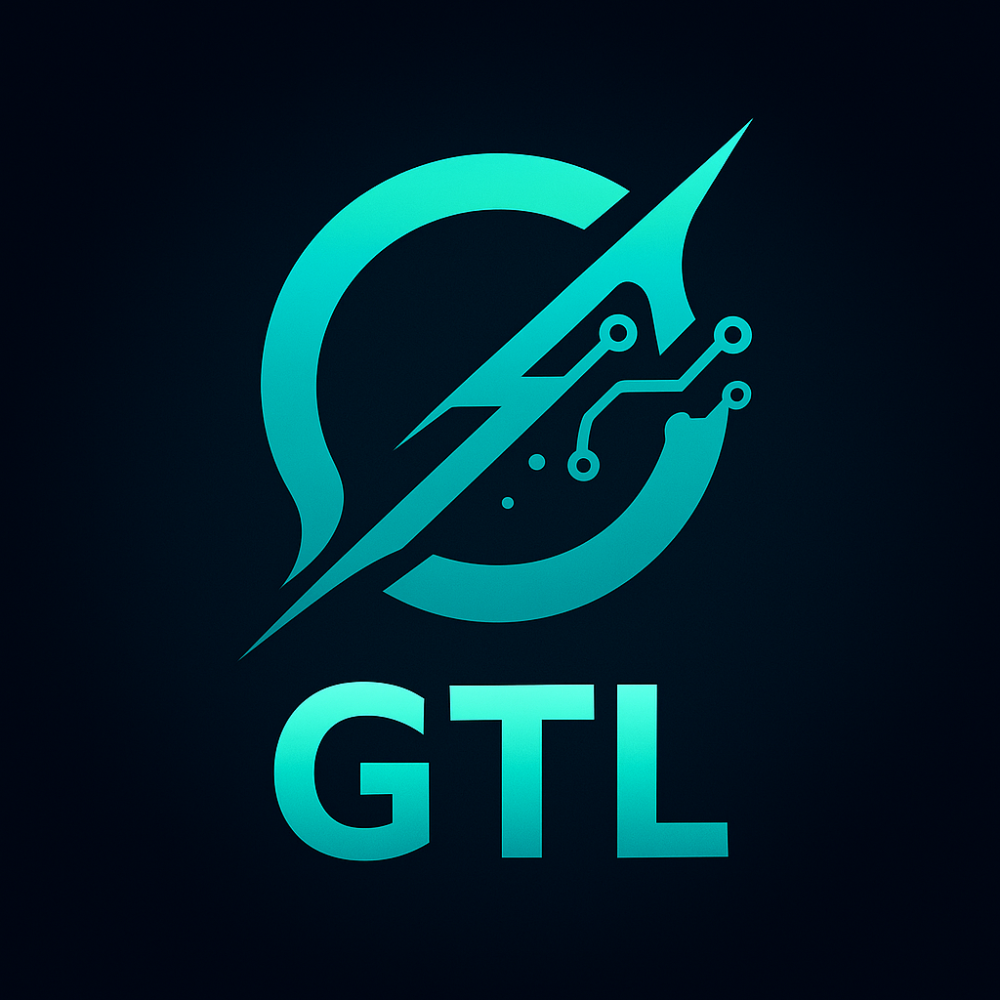

<div align="center">
  
</div>

# 👻 Ghost Transport Layer (GTL)

<div align="center">


</div>

## ⚠️ **DISCLAIMER**

⚠️ **EXPERIMENTAL LIBRARY - FOR LAB/PERSONAL USE** ⚠️

This is an experimental library under active development. It is
intended for research, learning, and personal projects. The API is subject
to change!

---

**The unified transport layer for all Ghost projects**

A consistent API across multiple protocols (QUIC, HTTP/3, gRPC, WebSockets, SSE, WebTransport, stdio) for reliable, low-latency AI interactions and multi-model orchestration.

---

## ⚡ Zig Implementation
### Zig Integration
```bash
zig fetch --save https://github.com/ghostkellz/GTL/archive/refs/heads/main.tar.gz
```

> **GTL (Zig)** is the Zig-based implementation of the unified multiprotocol transport backbone for the Ghost ecosystem.  
> Built with **zsync** for async, **zqlite** for persistence, and low-level QUIC bindings, this variant is lean, embeddable, and optimized for Ghostlang/Grim/Zeke integration.

### ✨ Key Features

- ⚡ **QUIC/HTTP3-first** using C ABI bindings  
- 🧵 **Async by zsync**: parallel session streams with no runtime GC  
- 📡 **Uniform RPC schema** with GTLFrame (token, patch, usage, control)  
- 🔒 **Auth**: GhostToken (OIDC/JWT) validated directly in Zig  
- 💾 **Persistence**: session resume & caching via zqlite  
- 🖥️ **Embeddable**: link GTL core into Zig apps (Grim, Zeke) with no ceremony  

---

## 🚀 Quickstart

### Clone & Build
```bash
git clone https://github.com/ghostkellz/gtl
cd gtl
zig build -Drelease-fast
```

---

## 🌐 Architecture

```
Clients (Grim / Zeke / CLI / nvim)
    │
    GTL Zig SDK (uniform API)
    │
    ┌─────────────────────────────────────┐
    │ Transport adapters (runtime-select) │
    │ • QUIC (HTTP/3 via msquic/quiche)   │
    │ • gRPC (HTTP/2 fallback)            │
    │ • WebSocket (JSON)                  │
    │ • SSE (HTTP/1.1 fallback)           │
    │ • WebTransport (browser QUIC)       │
    │ • Local pipe/stdio / UDS            │
    └─────────────────────────────────────┘
    │
Providers (OpenAI, Claude, Gemini, Copilot, Ollama, Local)
```

---

## 📦 Transport Selection

- **Same host (editor ↔ daemon):** stdio or UDS (fast, no TLS overhead)  
- **LAN/VPN:** gRPC over HTTP/2 (mature streaming)  
- **Public / lossy / mobile:** QUIC (HTTP/3) preferred  
- **Browsers:** WebTransport (QUIC), fallback gRPC-Web via proxy, fallback WebSocket  
- **Locked-down infra:** SSE over HTTP/1.1 as a last resort  

---

## 📡 Message Model

All transports carry the same events:

```jsonc
{ "type": "status", "state": "streaming" }
{ "type": "token", "text": "partial..." }
{ "type": "patch", "op": { "Replace": {
    "range": {"sl":10,"sc":0,"el":12,"ec":0},
    "text":"..." }}, "rev": 42 }
{ "type": "usage", "tokens_in":1024, "tokens_out":256, "cost":0.0031 }
{ "type": "error", "code":"PROVIDER_TIMEOUT", "msg":"..." }
{ "type": "done" }
```

**Encodings:**
- **Protobuf:** QUIC, gRPC, WebTransport
- **JSON:** WebSocket, SSE, local stdio

---

## 🔒 Security

- **Auth:** GhostToken (OIDC/JWT) supports Google/GitHub/Microsoft Entra
- **Scopes:** `chat:*`, `session:*`, `tools:*`
- **Audit:** Session metadata logging (model, usage, duration)
- **Zero-trust:** No provider keys in clients — daemon only

---

## 🧵 Zig SDK API (Preview)

```zig
pub const Transport = struct {
    pub fn unary(route: []const u8, req: []const u8) ![]u8;
    pub fn serverStream(route: []const u8, req: []const u8,
                        onEvent: fn([]const u8) void) !void;
    pub fn bidi(route: []const u8,
                onEvent: fn([]const u8) void) !StreamHandle;
};

pub fn connect(opts: ConnectOpts) !Transport {
    // Auto-select: stdio → quic → grpc → ws → sse
}
```

**Built on:**
- **zsync** for async parallelism
- **zqlite** for persistent caching + session resume  
- **C ABI bindings** to msquic/quiche for QUIC

---

## 🚀 Roadmap

### ✅ MVP (v0.1)
- GTLFrame event schema in Zig
- stdio + UDS transport
- WebSocket JSON transport
- Basic QUIC via msquic FFI
- GhostToken authentication

### 🔄 Next (v0.2)
- gRPC (HTTP/2) support
- SSE fallback for locked networks
- zqlite-based session resume
- Observability hooks (logs/metrics)

### 🌐 Future (v0.3+)
- HTTP/3 QUIC native transport
- WebTransport adapter for browsers
- Hot transport swapping
- Multi-region deployment

---

## 🔑 Why Zig?

- Matches Ghostlang/Grim ecosystem (C ABI, embeddable, lean)
- **zsync + zqlite** already proven in Zeke
- Manual memory + comptime = optimized parsers and streaming perf
- Bundle into apps without runtime dependencies

---

<div align="center">
  <em>GTL (Zig) — your lean, embeddable, QUIC-first transport layer for the Ghost ecosystem</em>
</div>
